# Minerva / MinervaClarity – Marp Theme for Sapienza-Style Presentations

An **unofficial** Marp theme inspired by the visual identity of **Sapienza University of Rome**. 

> [!WARNING]
> This is **not** an official Sapienza release. Use responsibly and follow institutional branding guidelines where required.

## Looks & Visual Comparison

Below is a slide‑by‑slide visual comparison of the Standard vs Clarity themes.

| Slide | Standard (Minerva)              | Clarity Variant                         |
| ----- | ------------------------------- | --------------------------------------- |
| 1     | 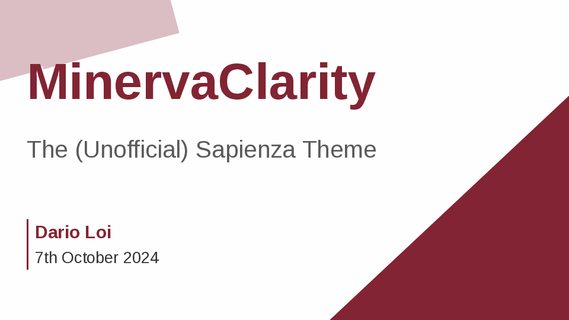 | 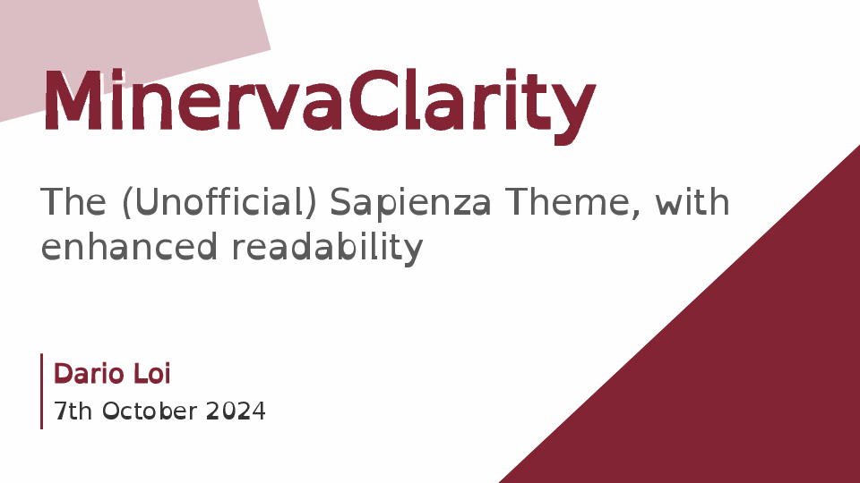 |
| 2     | 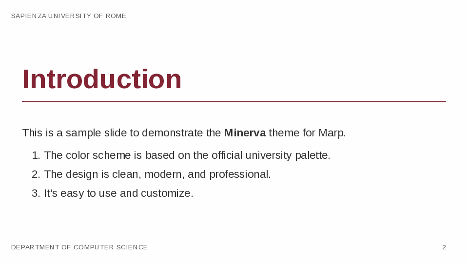 | 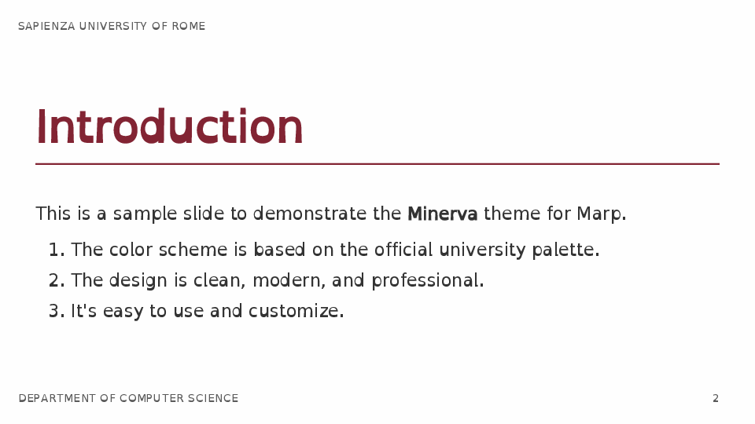 |
| 3     | 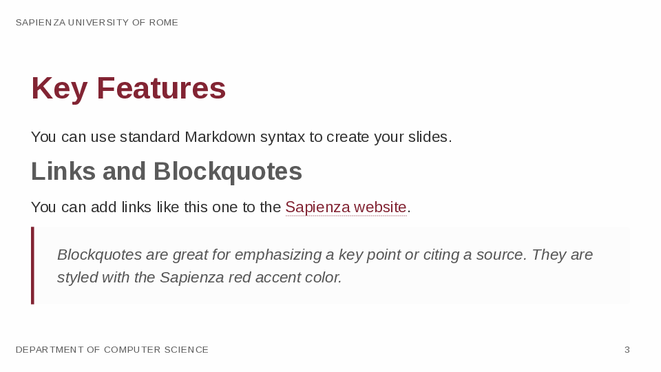 | 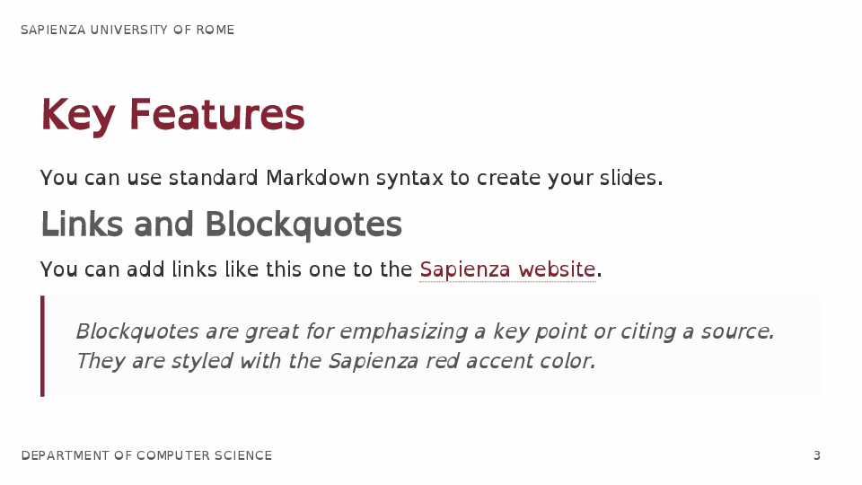 |
| 4     | 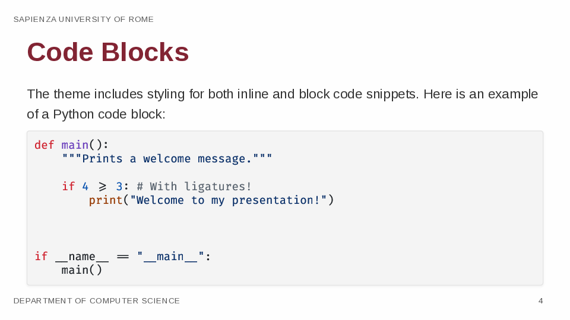 | 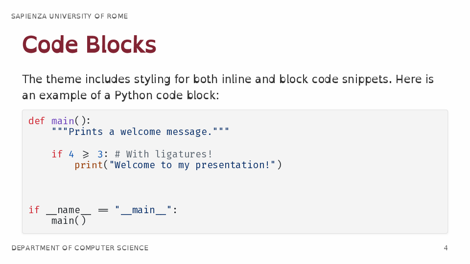 |
| 5     | 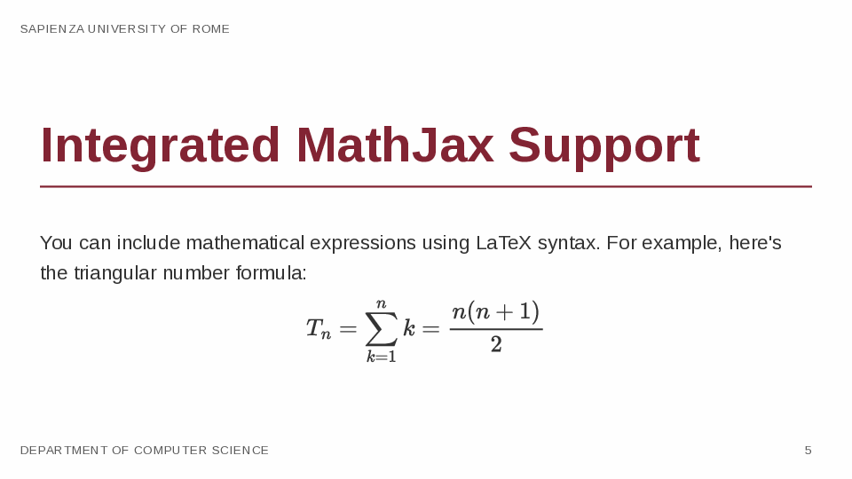 | 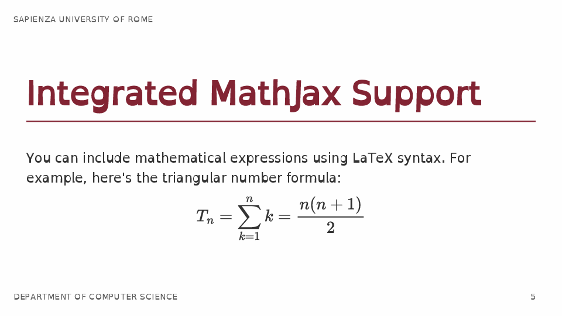 |
| 6     | 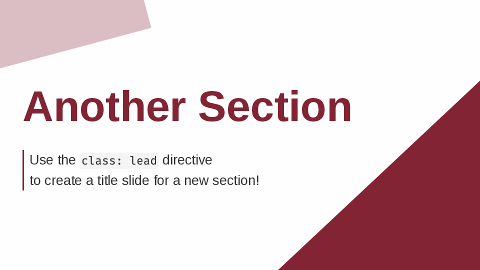 | 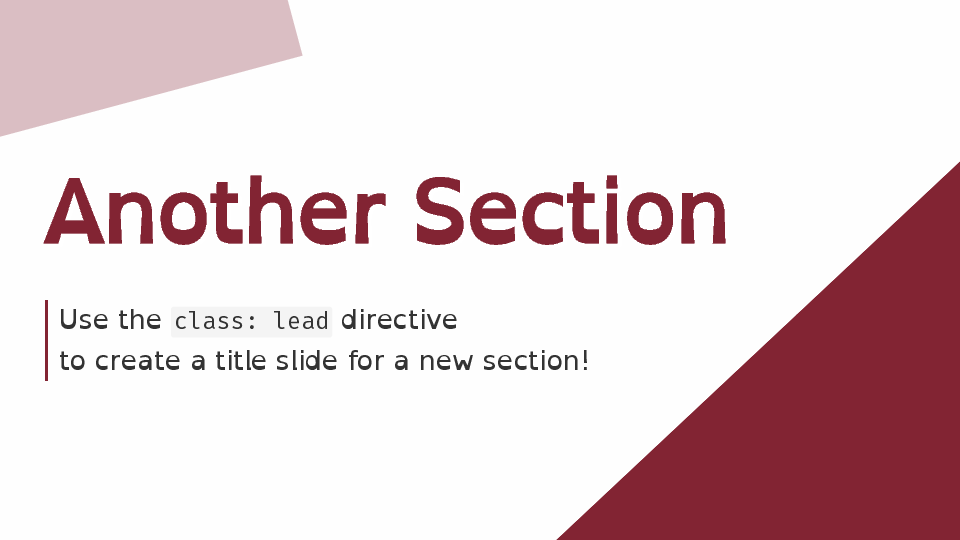 |

---
## Features

- Clean typography aligned with academic slide aesthetics
- Color accents matching Sapienza palette (primary deep red accent)
- Support for: code blocks, blockquotes, lists, links
- Built‑in MathJax (set via front‑matter: `math: mathjax`)
- Clarity variant with [OpenDyslexic](https://opendyslexic.org/) font for improved readability
- 16:9 widescreen layout + pagination, header, footer

--- 
## Quick Start (VS Code + Marp for VS Code)

### 1. Get the Marp Extension
Install the [Marp for VSCode extension](https://marketplace.visualstudio.com/items?itemName=marp-team.marp-vscode) for live preview and export capabilities.


### 2. Download the theme CSS files
Press `Ctrl+Shift+P` and select `Open Workspace Settings (JSON)` to add:
```json
"markdown.marp.themes": [
    "./minerva-theme.css",               // or ./minerva-theme-clarity.css
]
```
If the CSS files are downloaded and in your folder (recommended for customization), otherwise you can directly reference the GitHub raw URLs:

```json
"markdown.marp.themes": [
    "https://raw.githubusercontent.com/darioloi/minerva-marp-theme/main/minerva-theme.css",
    "https://raw.githubusercontent.com/darioloi/minerva-marp-theme/main/minerva-theme-clarity.css"
]
```

### 3. Export your Markdown slides to PDF
Using the Marp logo button in the top right of the editor, or `Ctrl+Shift+P` and select `Marp: Export Slide Deck`.

---
## Quick Start (Node.js + Marp CLI)

### 1. Install Marp CLI (if not already)
```bash
npm install -g @marp-team/marp-cli
```

### 2 Clone or copy the theme CSS into your project
Place the chosen CSS file(s) next to your Markdown presentation(s).

### 3. Add front‑matter to your `.md` deck
```yaml
---
marp: true
theme: minerva   # or keep 'minerva' but swap which CSS file you pass to marp CLI
size: 16:9
paginate: true
header: 'Sapienza University of Rome'
footer: 'Department of Computer Science'
math: mathjax
---
```

### 4. Export to PDF
Standard variant:
```bash
marp --allow-local-files --theme ./minerva-theme.css presentation.md -o example.pdf
```
Clarity variant:
```bash
marp --allow-local-files --theme ./minerva-theme-clarity.css presentation-clarity.md -o example_clarity.pdf
```

( `--allow-local-files` is needed if you reference local assets like images or custom fonts. )

### 5. Live Preview While Editing
```bash
marp -ps --allow-local-files --theme ./minerva-theme.css presentation.md
```
Then open the printed preview URL shown in the terminal.


---
## License
MIT License. See [LICENSE](LICENSE) for details.

---
## Attribution
Created by Dario Loi (example content). Inspired by Sapienza University branding (unofficial). Math rendering by MathJax. Powered by [Marp](https://marp.app/).
